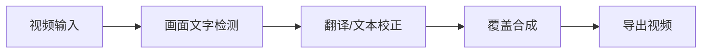

# 011 视频文字替换与翻译 | Video Text Translator

> 识别视频画面中的文字，翻译后重新合成一份可交付视频。
>
> **English:** A practical, runnable project with a documented workflow for the problem described above.

## 项目展示 / Demo

## 解决什么问题 / Problem

解决烧录字幕或画面文字难以批量替换、翻译和保持原画面布局的问题。

**English:** This project addresses the problem above with a reproducible local workflow.

## 有什么用 / Use

选择视频后识别文字区域，完成翻译、覆盖和导出，适合短视频和资料本地化。

**English:** Run the workflow locally, inspect the output, and extend the project from the provided source.

## 高光亮点 / Highlights

- 桌面端视频处理流程
- 文字识别与翻译串联
- 保留视频画面并输出新文件
- 支持按项目脚本继续扩展

## 技术名词 / Tech

`Python · JavaScript · FFmpeg · OCR · Translation API · Node.js`

## 从 ZIP 开始复现 / Reproduce from ZIP

1. 下载 ZIP 并解压。
2. 安装 requirements.txt 和 package.json 中的依赖。
3. 按项目根目录脚本启动前端/后端。
4. 选择测试视频，设置语言和输出目录。
5. 检查导出的字幕/文字区域和视频文件。

**Expected result:** 运行后以测试视频验证识别、翻译和导出链路；外部翻译服务需要按本地环境配置密钥。

## 目录提示 / Notes

- 先阅读本 README，再按项目内更详细的中文/英文文档补充配置。
- 不要把真实密码、Token、数据库业务数据和本机运行结果提交回仓库。
- 下载 ZIP 后的第一次运行应使用测试数据或示例图片，确认链路正常后再接入自己的环境。

[English documentation](README.en.md)
